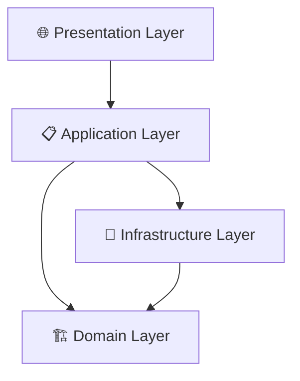

# 🚀 Movies API 
# NestJS Clean Architecture 


<div align="center">


*A production-ready API with Clean Architecture, DDD principles, and modern best practices*

</div>

---

## 🏛️ Architecture Overview

<div align="center">



</div>

### 🎯 **DDD Implementation**

| Layer | Responsibility | Examples |
|-------|---------------|----------|
| 🏗️ **Domain** | Pure business logic | Entities, Value Objects, Domain Services |
| 📋 **Application** | Use cases & orchestration | Create User, Get User |
| 🔧 **Infrastructure** | External concerns | Database, APIs, File System |
| 🌐 **Presentation** | HTTP layer | Controllers, DTOs, Validation |

**Key Principles:**
- ✨ **Pure Domain Entities** with class-validator decorators
- 🗄️ **Separated Models** for database persistence  
- 🔄 **Smart Mappers** between domain ↔ infrastructure
- 🛡️ **Repository Pattern** with clean interfaces
- ⚡ **Self-Validating Entities** with custom exceptions

### 📁 **Project Structure**

<details>
<summary>🔍 Click to expand folder structure</summary>

```
src/
├── 🏗️ domain/                    # Business logic and entities
│   ├── entities/                 # Domain entities (with class-validator)
│   ├── repositories/             # Repository interfaces
│   ├── exceptions/               # Domain-specific exceptions
│   └── value-objects/            # Value objects
├── 📋 application/               # Application layer
│   ├── use-cases/               # Business use cases
│   ├── interfaces/              # Application interfaces
│   └── dtos/                   # Data Transfer Objects
├── 🔧 infrastructure/           # External concerns
│   ├── database/               # Database configuration and migrations
│   ├── repositories/           # Repository implementations
│   ├── models/                # TypeORM models (database entities)
│   ├── mappers/               # Domain-Infrastructure mappers
│   ├── modules/               # NestJS modules
│   ├── config/               # Configuration files
│   └── external/             # External service integrations
├── 🌐 presentation/             # Presentation layer
│   ├── controllers/           # REST controllers (call use cases directly)
│   ├── guards/               # Authentication guards
│   ├── interceptors/         # Response interceptors
│   └── middleware/           # Custom middleware
└── 🛠️ shared/                   # Shared utilities
    ├── types/               # TypeScript types
    ├── utils/              # Utility functions
    ├── constants/          # Application constants
    ├── filters/            # Exception filters
    ├── interceptors/       # Global interceptors
    └── decorators/         # Custom decorators
```

</details>

---

## ⭐ Features

<div align="center">

| Feature | Description | Status |
|---------|-------------|--------|
| 🏛️ **Clean Architecture** | Separation of concerns with clear boundaries | ✅ |
| 🎯 **Domain-Driven Design** | Pure entities with class-validator | ✅ |
| 🗄️ **TypeORM** | Object-Relational Mapping with PostgreSQL | ✅ |
| 🐳 **Docker** | Containerized development environment | ✅ |
| ⚙️ **Environment Config** | Multiple environment support | ✅ |
| 📚 **Swagger Docs** | Auto-generated API documentation | ✅ |
| ✅ **Validation** | Request validation with class-validator | ✅ |
| 🚨 **Error Handling** | Global exception filters | ✅ |
| 🔄 **Response Interceptors** | Consistent API responses | ✅ |
| 🌐 **CORS** | Cross-Origin Resource Sharing | ✅ |
| 🛡️ **Security** | Helmet for security headers | ✅ |
| ⏱️ **Rate Limiting** | Request throttling | ✅ |

</div>

---

## 🚀 Quick Start

### 📋 **Prerequisites**
- 🟢 Node.js (v20+)
- 🐳 Docker & Docker Compose
- 📦 npm or yarn

### ⚡ **Setup**

<details>
<summary>🔧 Manual Setup</summary>

```bash
# 1. Clone the repository
git clone <repository-url>
cd movies-api-nest

# 2. Install dependencies
npm install

# 3. Setup environment
cp .env.example .env
# Edit .env file with your configuration if needed

# 4. Start Docker services (PostgreSQL)
npm run docker:up

# 5. Wait for database to be ready (optional)
sleep 10

# 6. Run database migrations
npm run migration:run

# 7. Seed database with sample data
npm run seed

# 8. Start development server
npm run start:dev
```

**🎯 Your API is now running at:**
- API: `http://localhost:3000`
- Swagger: `http://localhost:3000/api/docs`

</details>

<details>
<summary>🎯 Quick Setup (Automated)</summary>

```bash
# Run the setup script
chmod +x scripts/setup.sh
./scripts/setup.sh
```

</details>

### 🌐 **Access Points**

| Service | URL | Credentials |
|---------|-----|-------------|
| 🚀 **API** | `http://localhost:3000` | - |
| 📚 **Swagger** | `http://localhost:3000/api/docs` | - |
| 🐘 **PostgreSQL** | `localhost:5432` | postgres / postgres |

---

## 🛠️ Development

### 📜 **Available Scripts**

<div align="center">

| Command | Description | Usage |
|---------|-------------|-------|
| 🚀 `start:dev` | Development with hot reload | `npm run start:dev` |
| 🏗️ `build` | Build for production | `npm run build` |
| 🧪 `test` | Run unit tests | `npm run test` |
| 🔍 `lint` | Run ESLint | `npm run lint` |
| 🗄️ `migration:run` | Run database migrations | `npm run migration:run` |
| 🌱 `seed` | Run database seeders | `npm run seed` |
| 🐳 `docker:up` | Start Docker services | `npm run docker:up` |

</div>

### 🗄️ **Database Operations**

<details>
<summary>📊 Migration Commands</summary>

```bash
# Generate migration
npm run migration:generate -- MigrationName

# Run migrations
npm run migration:run

# Revert migration
npm run migration:revert
```

</details>

<details>
<summary>🌱 Seeder Commands</summary>

```bash
# Run all seeders
npm run seed

# Alternative command
npm run seed:run
```

**Default Users Created:**
- 👨‍💼 **John Doe** - john.doe@example.com
- 👩‍💼 **Jane Smith** - jane.smith@example.com  
- 🔑 **Admin User** - admin@example.com

*Default password for all users: `password123`*

</details>

### 🧪 **Testing**

```bash
npm run test        # Unit tests
npm run test:e2e    # End-to-end tests  
npm run test:cov    # Test coverage
```

---

## 🌐 API Endpoints

| Method | Endpoint | Description | Response |
|--------|----------|-------------|----------|
| 🟢 `POST` | `/users` | Create new user | `201 Created` |
| 🔵 `GET` | `/users/:id` | Get user by ID | `200 OK` |
| 💚 `GET` | `/health` | Health check | `200 OK` |
| 📚 `GET` | `/api/docs` | API documentation | Swagger UI |

---

## ⚙️ Configuration

<details>
<summary>🔧 Environment Variables</summary>

| Variable | Description | Required |
|----------|-------------|----------|
| `NODE_ENV` | Application environment | ✅ |
| `PORT` | Server port | ✅ |
| `API_PREFIX` | API route prefix | ✅ |
| `DB_HOST` | Database host | ✅ |
| `DB_PORT` | Database port | ✅ |
| `DB_USERNAME` | Database username | ✅ |
| `DB_PASSWORD` | Database password | ✅ |
| `DB_DATABASE` | Database name | ✅ |
| `JWT_SECRET` | JWT secret key | ✅ |
| `JWT_EXPIRES_IN` | JWT expiration time | ✅ |
| `CORS_ORIGIN` | CORS allowed origin | ❌ |
| `SWAGGER_TITLE` | API documentation title | ❌ |

**⚠️ Important:** All required variables must be set in `.env` file. The application will fail to start if any required variable is missing.

</details>

## 🔧 Adding New Features

<details>
<summary>📋 Step-by-step guide</summary>

### 🏛️ **Layer-by-Layer Approach**

1. **🏗️ Domain Layer**: Pure business logic (no dependencies)
2. **📋 Application Layer**: Use cases & DTOs (domain only)  
3. **🔧 Infrastructure Layer**: Repositories, modules & external services
4. **🌐 Presentation Layer**: Controllers calling use cases directly

### 📝 **Example: Adding a Product Entity**

```bash
# 1. Domain entity (pure business logic)
src/domain/entities/product.entity.ts

# 2. Repository interface
src/domain/repositories/product.repository.interface.ts

# 3. DTOs for API
src/application/dtos/create-product.dto.ts

# 4. Use cases
src/application/use-cases/product/create-product.use-case.ts

# 5. TypeORM model
src/infrastructure/models/product.model.ts

# 6. Domain ↔ Infrastructure mapper
src/infrastructure/mappers/product.mapper.ts

# 7. Repository implementation
src/infrastructure/repositories/product.repository.ts

# 8. REST controller
src/presentation/controllers/product.controller.ts

# 9. NestJS module
src/infrastructure/modules/product.module.ts
```

</details>

---

<div align="center">

## 🤝 Contributing

**Found a bug?** [Open an issue](../../issues)  
**Want to contribute?** [Submit a PR](../../pulls)  
**Need help?** [Start a discussion](../../discussions)

---

## 📄 License

This project is licensed under the **MIT License**

---

<sub>Built with ❤️ using Clean Architecture principles</sub>

</div>
